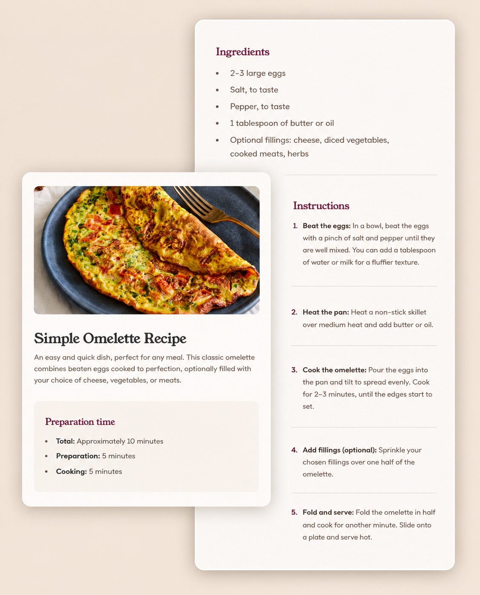

# 🥗 Nutrition Summary Card

A clean and responsive nutrition summary card built using **HTML and CSS**.

This project was my first frontend project created while learning the fundamentals of web development. It focuses on building structured layouts, improving UI styling skills, and creating responsive card-based components using pure HTML and CSS.

## 🚀 Live Demo

🔗 **Live Website:**  

## 📸 Preview

## ✨ What This Project Does

✅ Displays nutrition information inside a styled summary card  

✅ Organizes content using clean layout structure  

✅ Uses responsive design principles for different screen sizes  

✅ Focuses on visually appealing UI design  

✅ Demonstrates HTML and CSS fundamentals  

✅ Creates a clean and beginner-friendly frontend component  

## ⚡ Features

- 🥗 Nutrition summary card layout
  
- 🎨 Modern UI styling

- 📱 Responsive design
  
- ✨ Clean typography and spacing
  
- 📦 Structured card-based component
  
- 🌐 Pure HTML & CSS implementation
  
- 🧠 Beginner-friendly project structure

## 🛠️ Tech Stack

- 🌐 HTML5
  
- 🎨 CSS3

---

## 💡 Concepts Practiced : 

This project helped me learn and practice:

- CSS Styling
  
- Flexbox/Grid Layouts
  
- Spacing and Alignment
  
- Responsive Design
  
- Component-Based UI Design
  
- Frontend Structure Fundamentals

├── style.css
└── preview.jpg
